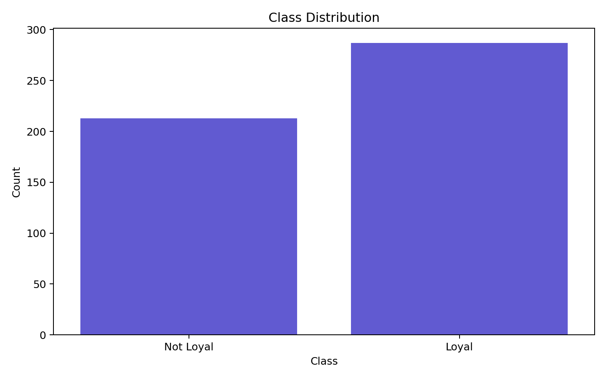
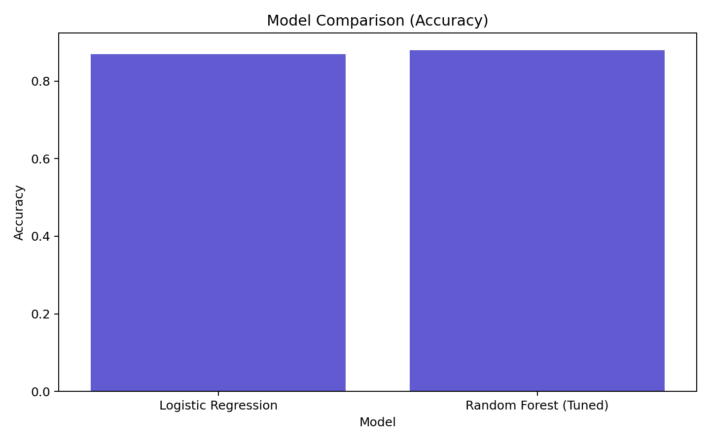
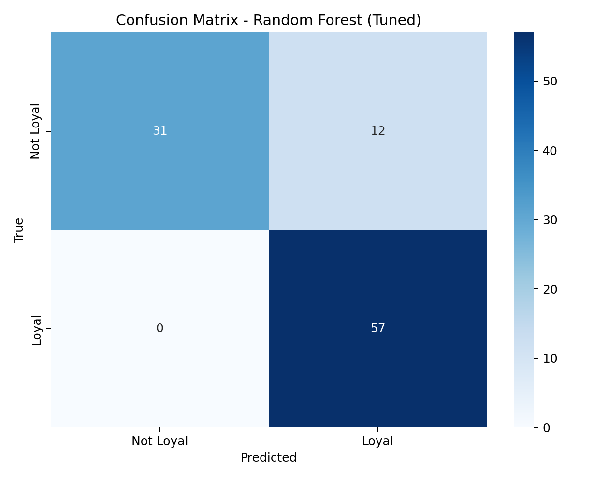
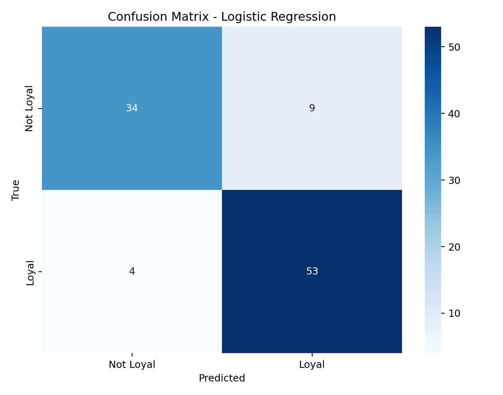
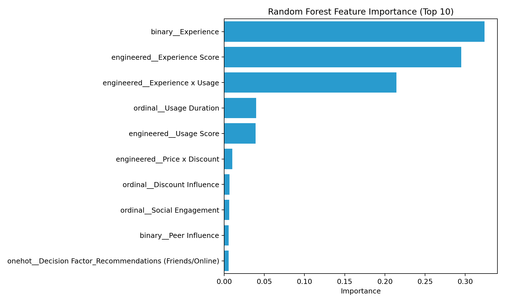

# Smartphone Brand Loyalty Prediction using Machine Learning

Clean, leakage-free, binary classification system for predicting student brand loyalty.

## 1) Problem Statement

Predict whether a student is:
- **Loyal (1)**: `Very likely` or `Somewhat likely` to continue the same brand
- **Not Loyal (0)**: `Not likely`

Why this matters:
- Business: retention strategy, segment prioritization, pricing and campaign optimization
- Behavioral: understanding how experience, usage maturity, social behavior, and value sensitivity shape loyalty

## 2) Dataset Description

- Source: Google Form survey
- File: `data/project dataset.xlsx`
- Samples: 500
- Removed: `Timestamp`, `Email`
- Leakage removed: `Next Purchase Decision` (excluded entirely)

Features used:
- `Brand`
- `Usage Duration`
- `Experience`
- `Discount Influence`
- `Peer Influence`
- `Decision Factor`
- `Social Engagement`
- `Price Importance`

Target source column:
- `How likely are you to continue using this brand in the future?`

Binary conversion:
- `Very likely`, `Somewhat likely` -> `Loyal (1)`
- `Not likely` -> `Not Loyal (0)`

## 3) Data Preprocessing (Detailed)

The pipeline uses `sklearn` `Pipeline` + `ColumnTransformer` for reproducibility.

- **Ordinal encoding**
  - `Usage Duration`
  - `Discount Influence`
  - `Social Engagement`
- **Binary encoding**
  - `Experience` (`Yes/No`)
  - `Peer Influence` (`Yes/No`)
- **One-hot encoding**
  - `Brand`
  - `Decision Factor`
  - `Price Importance`

Feature engineering (minimal and interpretable):
- `Experience Score`
- `Usage Score`
- `Engagement Score`
- `Experience x Usage`
- `Price x Discount`

## 4) Model Selection

Final models in production code:
- **Random Forest (Tuned)** -> deployment model
- **Logistic Regression** -> comparison baseline

Why Random Forest:
- Handles non-linear behavior with mixed categorical/ordinal signals
- More robust to interaction patterns common in survey data
- Delivers highest test accuracy in this project

Why not deep learning:
- Dataset is relatively small (500 rows)
- Tabular structure and interpretability requirements favor tree/linear methods

## 5) Model Performance

From `artifacts/reports/project_experiment_metadata.json`:

| Model | Accuracy | F1 | Precision | Recall | ROC-AUC | CV Score |
|---|---:|---:|---:|---:|---:|---:|
| Random Forest (Tuned) | 0.88 | 0.9048 | 0.8261 | 1.0000 | 0.9310 | 0.8920 |
| Logistic Regression | 0.87 | 0.8908 | 0.8548 | 0.9298 | 0.9315 | 0.8560 |

## 6) Overfitting Analysis

Random Forest:
- Train accuracy: `0.9025`
- Test accuracy: `0.8800`
- Gap: `0.0225`

Interpretation:
- Low gap indicates controlled overfitting and stable generalization.

## 7) Feature Importance

Top contributors include:
- `Experience`
- `Experience Score`
- `Experience x Usage`
- `Usage Duration`
- `Price x Discount`

Behavioral meaning:
- Positive product experience and sustained brand usage are the strongest loyalty signals.

## 8) Key Insights

- Experience quality strongly separates loyal vs non-loyal users.
- Usage maturity (time with brand) reinforces loyalty behavior.
- Price-discount interaction matters at decision boundaries.
- Social engagement and peer influence provide supporting context, but weaker than direct experience factors.

## 9) Project Structure

```text
project/
│── data/
│   └── project dataset.xlsx
│
│── src/
│   └── brand_loyalty/
│       ├── config.py
│       ├── data.py
│       ├── preprocessing.py
│       ├── train.py
│       ├── predictor.py
│
│── artifacts/
│   ├── models/
│   ├── plots/
│   └── reports/
│
│── notebooks/
│   └── brand_loyalty_analysis.ipynb
│
│── app.py
│── README.md
│── requirements.txt
```

## 10) How to Run

```bash
python -m src.brand_loyalty.train
streamlit run app.py
```

## 11) Streamlit Dashboard

Left panel:
- Full questionnaire inputs
- Prediction + confidence score

Right panel:
- Dataset Overview
- Model Performance Table
- Overfitting Check
- Feature Importance
- Behavioral Insights

## 12) Plot Gallery and Interpretation

### Class Distribution


What this tells us:
- Shows the balance between `Loyal` and `Not Loyal` classes.
- Confirms whether class imbalance handling is necessary.

### Model Comparison (Accuracy)


What this tells us:
- Compares test accuracy between Logistic Regression and Random Forest.
- Confirms Random Forest as the best deployment model in this project.

### Random Forest Confusion Matrix


What this tells us:
- Displays true vs predicted classes for the final model.
- Helps identify error types (false positives vs false negatives).

### Logistic Regression Confusion Matrix


What this tells us:
- Baseline error pattern for comparison against Random Forest.
- Useful to explain why tree-based modeling was selected.

### Random Forest Feature Importance


What this tells us:
- Ranks the top predictive features in the final model.
- Highlights which behavioral variables most influence loyalty prediction.

## 13) Future Improvements

- Calibrated probabilities for threshold-sensitive decisioning
- Confidence intervals via bootstrap evaluation
- Segment-wise fairness and stability analysis
- Periodic retraining with new cohorts

